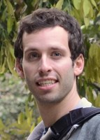

I am an postdoctoral fellow at the [Institute for Quantum Computing] and
the [Department of Combinatorics and Optimization] at the [University of Waterloo]
(currently supervised by [Andrew Childs] and [Michele Mosca]).

I completed my PhD in Physics in 2011 at [MIT] under the supervision of
[Eddie Farhi].

Before that, I did my undergraduate degree in physics and math at [UBC].

I am interested in quantum algorithms, quantum walks, Hamiltonian
complexity theory, and other areas in quantum computation and quantum
information.

I can be reached by email at dngosset at gmail dot com.

# List of Publications

- pub1
- pub2
- pub3

[Institute for Quantum Computing]: http://iqc.uwaterloo.ca
[Department of Combinatorics and Optimization]: http://math.uwaterloo.ca/combinatorics-and-optimization/
[University of Waterloo]: http://uwaterloo.ca
[Andrew Childs]: https://services.iqc.uwaterloo.ca/people/profile/amchilds/
[Michele Mosca]: https://services.iqc.uwaterloo.ca/people/profile/mmosca/
[MIT]: http://mit.edu
[Eddie Farhi]: http://web.mit.edu/physics/people/faculty/farhi_edward.html
[UBC]: http://www.ubc.ca
[IQC Link]: https://services.iqc.uwaterloo.ca/people/profile/dgossetIQC/
